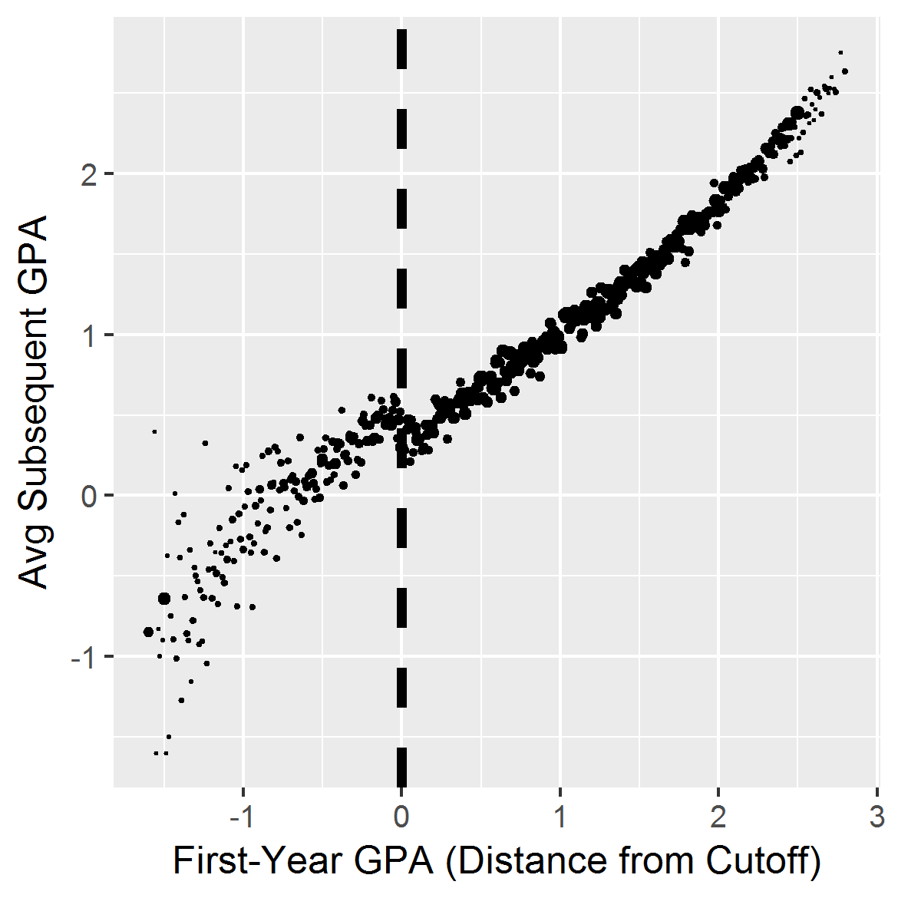
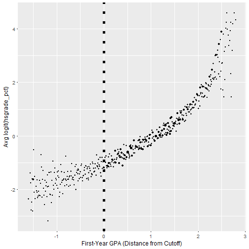
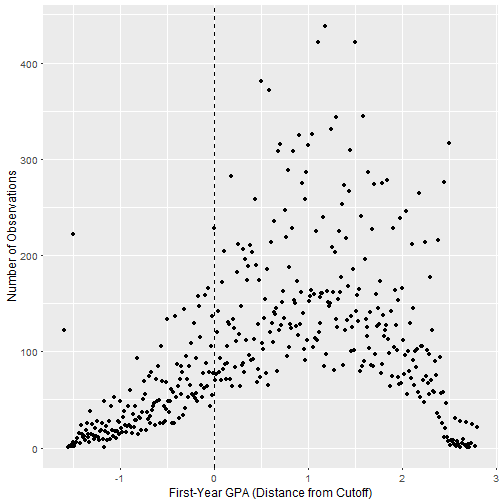
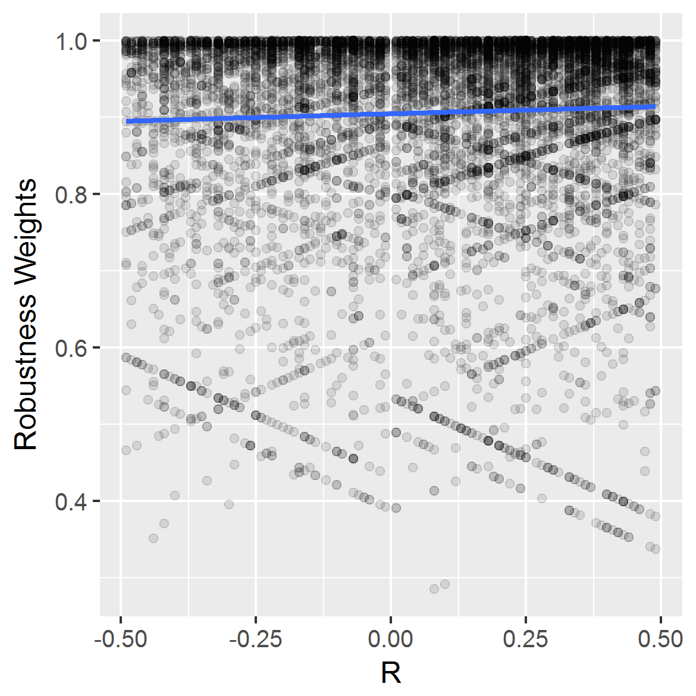
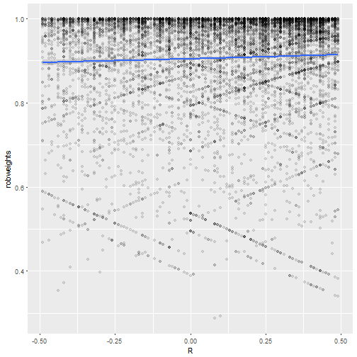

Initialization.
If the variable `paperdir` is supplied, LaTeX code for the tables is saved there, for inclusion in the main paper; otherwise, the code is saved in the current working directory.


General dependencies.

```r
#print(getwd())
library('knitr')
library(ggplot2)
library(xtable)
library(robustbase)
library(rdd)
```

```
## Loading required package: sandwich
```

```
## Loading required package: lmtest
```

```
## Loading required package: zoo
```

```
## 
## Attaching package: 'zoo'
```

```
## The following objects are masked from 'package:base':
## 
##     as.Date, as.Date.numeric
```

```
## Loading required package: AER
```

```
## Loading required package: car
```

```
## Loading required package: survival
```

```
## 
## Attaching package: 'survival'
```

```
## The following object is masked from 'package:robustbase':
## 
##     heart
```

```
## Loading required package: Formula
```

```r
source("R/functions.r")
source("R/data.r")
source("R/ddsandwich.r")
```


```r
ciChar <- function(ci,est=FALSE){
    #ci <- round(ci,2)
    ci.out <- paste('(',round2(ci[1]),', ',round2(ci[2]),')',sep='')
    if(est) ci.out <- c(ci.out,as.character(ci[3]))
    ci.out
}

round2 <- function(x) sprintf('%.2f',x)#round(x,2)

nfunc <- function(bw) sum(abs(dat$R)<bw,na.rm=TRUE)

Wfunc <- function(W)
    paste0('[',round2(W[1]), ', ',round2(W[2]),')')
```


Load data. This routine will download and unzip the Lindo et al. replication
material into the `extdata` subdirectory.

```r
if(!is.element('dat',ls())){
  extdata_dir <- 'extdata'
  LSO_dta_location <- paste0(extdata_dir,'/data_for_analysis.dta')
  if(!file.exists(LSO_dta_location)){
    loc2 <- fetchLSOdata(extdata_dir)
    stopifnot(loc2==LSO_dta_location)
  }
  dat <- foreign::read.dta(LSO_dta_location)
  dat$dist_from_cut <- round(dat$dist_from_cut,2)
  dat$hsgrade_pct[dat$hsgrade_pct==100]=99.5
  dat$lhsgrade_pct=qlogis(dat$hsgrade_pct/100)
  dat$R <- dat$dist_from_cut
  dat$Z <- dat$gpalscutoff
}
```

Total sample size, and number of "compliers" (students whose actual AP
status matched what would have been predicted from first-year GPA)

```r
ncomp <- with(dat,sum(gpalscutoff& !probation_year1))
ntot <- nrow(dat)
```

Create RDD plots. First of the outcome (subsequent GPA):

```r
figDat <- aggregate(dat[,c('nextGPA','lhsgrade_pct')],by=list(R=dat$R),
                    FUN=mean,na.rm=TRUE)
figDat$n <- as.vector(table(dat$R))

ggplot(figDat,aes(R,nextGPA,size=n))+
  geom_point()+
  geom_vline(xintercept=0,linetype='dashed',size=1.5)+
  xlab('First-Year GPA (Distance from Cutoff)')+ylab('Avg Subsequent GPA')+
  scale_size_continuous(range=c(0.2,2),guide=FALSE)+
  theme(text = element_text(size=12))
```


then a covariate (High-School GPA):

```r
ggplot(figDat,aes(R,lhsgrade_pct,size=n))+geom_point()+geom_vline(xintercept=0,linetype='dotted',size=2)+xlab('First-Year GPA (Distance from Cutoff)')+ylab('Avg logit(hsgrade_pct)')+scale_size_continuous(range=c(0.2,2),guide=FALSE)+theme(text = element_text(size=12))
```



The McCrary density test failure and recovery described in Section 4.1

```r
ggplot(figDat,aes(R,n))+
  geom_point()+
  geom_vline(xintercept=0,linetype='dashed',size=.5)+
  xlab('First-Year GPA (Distance from Cutoff)')+
  ylab('Number of Observations')+
  scale_size_continuous(range=c(0.2,2),guide=FALSE)+
  theme(text = element_text(size=12))
```



```r
(mccrary1 <- rdd::DCdensity(dat$R,-0.005, bin=0.01,plot=FALSE) )
```

```
## [1] 0.000668
```

```r
( mccraryDougnut <- rdd::DCdensity(dat$R[dat$R!=0],-0.005, bin=0.01,plot=FALSE) )
```

```
## [1] 0.154
```

The Frandsen (2016) test for manipulation when the
running variable is discrete, when the cutoff is the maximum GPA
receiving probation, or the minimum GPA not receiving probation:

```r
(frandsen1 <- frandsen(dat$R,cutoff=-0.01,BW=0.5))
```

```
##          k        p
## 1 0.000000 1.00e-13
## 2 0.000684 1.05e-13
## 3 0.010000 2.04e-13
## 4 0.020000 4.13e-13
## 5 0.100000 1.05e-10
```

```r
(frandsen2 <- frandsen(dat$R,cutoff=0,BW=0.5))
```

```
##          k p
## 1 0.000000 0
## 2 0.000684 0
## 3 0.010000 0
## 4 0.020000 0
## 5 0.100000 0
```


## main analysis ##

The sh method uses `lmrob`, which in turn requires a random
seed.  For confidence interval and estimation routines it's
helpful to use the same seed throughout, as this means the
S-estimation initializers will always be sampling the same
subsets of the sample.


```r
set.seed(201705)
lmrob_seed <- .Random.seed


SHmain <- sh(subset(dat,R!=0),BW=0.5,outcome='nextGPA',Dvar='probation_year1')
unlist(SHmain)
```

```
##  p.value   CI.CI1   CI.CI2   CI.est       BW bal.pval       W1       W2 
## 1.89e-11 1.69e-01 3.08e-01 2.38e-01 5.00e-01 1.00e+00 1.00e-02 5.00e-01 
##        n 
## 1.00e+04
```

```r
# No-donut variant (not discussed in text)
SHnodo <- sh(dat, BW=0.5, outcome='nextGPA',Dvar='probation_year1')

SHdataDriven <- sh(dat=subset(dat,R!=0),outcome='nextGPA')
unlist(SHdataDriven)
```

```
##  p.value   CI.CI1   CI.CI2   CI.est       BW bal.pval       W1       W2 
## 1.33e-19 1.68e-01 2.61e-01 2.15e-01 1.03e+00 1.54e-01 1.00e-02 1.03e+00 
##        n 
## 2.16e+04
```

```r
SHcubic <- sh(dat=subset(dat,R!=0),BW=0.5,outcome='nextGPA',rhs='~Z+poly(R,3)')
unlist(SHcubic)
```

```
##  p.value   CI.CI1   CI.CI2   CI.est       BW bal.pval       W1       W2 
## 6.33e-07 1.47e-01 3.37e-01 2.42e-01 5.00e-01 1.00e+00 1.00e-02 5.00e-01 
##        n 
## 1.00e+04
```

```r
SHitt <- sh(dat=subset(dat,R!=0),BW=0.5,outcome='nextGPA', Dvar=NULL)
unlist(SHitt) # (AS has no aversion to scatalogical humor)
```

```
##  p.value   CI.CI1   CI.CI2   CI.est       BW bal.pval       W1       W2 
## 1.89e-11 1.68e-01 3.07e-01 2.38e-01 5.00e-01 1.00e+00 1.00e-02 5.00e-01 
##        n 
## 1.00e+04
```

Create Table 1:

```r
resultsTab <-
 do.call('rbind',
  lapply(list(main=SHmain,data_driven=SHdataDriven,cubic=SHcubic,ITT=SHitt),
   function(res) c(round2(res$CI[3]),
                   ciChar(res$CI[1:2]),
                   W=Wfunc(res$W),
                   n=prettyNum(res$n,',',trim=TRUE))))

colnames(resultsTab) <- c('Estimate','95\\% CI','$\\mathcal{W}$','$n$')


kable(resultsTab)
```


|            |Estimate |95\% CI      |$\mathcal{W}$ |$n$    |
|:-----------|:--------|:------------|:-------------|:------|
|main        |0.24     |(0.17, 0.31) |[0.01, 0.50)  |10,014 |
|data_driven |0.21     |(0.17, 0.26) |[0.01, 1.03)  |21,593 |
|cubic       |0.24     |(0.15, 0.34) |[0.01, 0.50)  |10,014 |
|ITT         |0.24     |(0.17, 0.31) |[0.01, 0.50)  |10,014 |

```r
resultsTab <- cbind(Specification=c('Main','Adaptive $\\mathcal{W}$','Cubic','ITT'),resultsTab)

print(xtable(resultsTab,align='rlcccc'),
  file=paste0(paperdir,"/tab-results.tex"), floating=F,
  include.rownames=FALSE,
  sanitize.colnames.function=function(x) x,
  sanitize.text.function=function(x) x)
```

Results from two alternative methods, creating Table 2:

```r
CFT <- cft(subset(dat,R!=0),BW=NULL,outcome='nextGPA')
IK <- ik(dat,outcome='nextGPA')

altTab <-
 do.call('rbind',
  lapply(list(`Local Linear`=IK,Limitless=SHitt,`Local Permutation`=CFT),
   function(res) c(round2(res$CI[3]),
    ciChar(res$CI[1:2]),
    W=Wfunc(res$W),
    n=prettyNum(res$n,',',trim=TRUE))))


colnames(altTab) <- c('Estimate','95\\% CI','$\\mathcal{W}$','$n$')

kable(altTab)
```


|                  |Estimate |95\% CI      |$\mathcal{W}$ |$n$    |
|:-----------------|:--------|:------------|:-------------|:------|
|Local Linear      |0.24     |(0.19, 0.28) |[0.00, 1.25)  |26,647 |
|Limitless         |0.24     |(0.17, 0.31) |[0.01, 0.50)  |10,014 |
|Local Permutation |0.11     |(0.05, 0.17) |[0.01, 0.18)  |3,436  |

```r
altTab <- cbind(Method=rownames(altTab),altTab)

print(xtable(altTab,align='rlcccc'),
  file=paste0(paperdir,"/tab-alt.tex"), floating=F,
  include.rownames=FALSE,
  sanitize.colnames.function=function(x) x)
```


## Examine robustness weights

If there are regions of the data of high influence, the robust fitter
should reject or downweight more frequently in those regions, and we'll see dips
on the plot of robustness weights vs R.

Here is the plot corresponding to the main analysis presented in the paper.

```r
lmrob_main <- lmrob(nextGPA~Z+R,
              offset=(SHmain$CI[3]*probation_year1),
              data=dat,subset=(R!=0 & abs(R)<.5),
              method='MM',
              control=lmrob.control(seed=lmrob_seed,
                            k.max=500, maxit.scale=500)
              )
```

Robustness weights are mostly near 1, never below .25.

```r
robwts_main <- weights(lmrob_main, type="robustness")
summary(robwts_main)
```

```
##    Min. 1st Qu.  Median    Mean 3rd Qu.    Max. 
##   0.285   0.874   0.959   0.906   0.992   1.000
```

Not too much pattern to the robustness weights --
although the lowest values do occur at slightly above
the cutpoint, where we'd see savvy students whose
rose above the cut due to savvyness.


```r
require(mgcv)
```

```
## Loading required package: mgcv
```

```
## Loading required package: nlme
```

```
## This is mgcv 1.8-27. For overview type 'help("mgcv-package")'.
```

```r
ggp_main <- ggplot(data.frame(R=lmrob_main$model$R,
                              robweights=robwts_main),
                   aes(x=R,y=robweights))
ggp_main + geom_point(alpha=.1) + stat_smooth()+theme(text = element_text(size=12))+ylab('Robustness Weights')
```

```
## `geom_smooth()` using method = 'gam'
```



When we fit without omitting R=0 students, here is
the best fitting version of the model.


```r
lmrob_nodo <- lmrob(nextGPA~Z+R,
              offset=(SHnodo$CI[3]*probation_year1),
              data=dat,subset=(abs(R)<.5),
              method='MM',
              control=lmrob.control(seed=lmrob_seed,
                                    k.max=500, maxit.scale=500)
      )

robwts_nodo <- weights(lmrob_nodo, type="robustness")
```

Do the observations at R=0 stand out?
With no donut, robustness weights have a slight tendency
to be lower among observations at R=0.


```r
by(robwts_nodo,
   lmrob_nodo$model$R==0, summary)
```

```
## lmrob_nodo$model$R == 0: FALSE
##    Min. 1st Qu.  Median    Mean 3rd Qu.    Max. 
##   0.287   0.874   0.959   0.907   0.992   1.000 
## -------------------------------------------------------- 
## lmrob_nodo$model$R == 0: TRUE
##    Min. 1st Qu.  Median    Mean 3rd Qu.    Max. 
##   0.389   0.860   0.954   0.889   0.989   1.000
```

```r
t.test(wt~atcut, data.frame(wt=robwts_nodo,
                            atcut=(lmrob_nodo$model$R==0)),
       var.equal=F, alternative="g")
```

```
## 
## 	Welch Two Sample t-test
## 
## data:  wt by atcut
## t = 2, df = 200, p-value = 0.04
## alternative hypothesis: true difference in means is greater than 0
## 95 percent confidence interval:
##  0.00151     Inf
## sample estimates:
## mean in group FALSE  mean in group TRUE 
##               0.907               0.889
```

The plot is similar to that of the main analysis,
with some low robustness weight observations as R=0
but also plenty of ordinary weight observations there.

```r
ggp_nodo <- ggplot(data.frame(R=lmrob_nodo$model$R,
                              robweights=robwts_nodo),
                   aes(x=R,y=robweights))
ggp_nodo + geom_point(alpha=.1) + stat_smooth()
```

```
## `geom_smooth()` using method = 'gam'
```




Save results:

```r
save(list=ls(),file=paste0('RDanalysis-',format(Sys.time(),"%m%d%H%M"),'.RData'))
```

Session information

```r
sessionInfo()
```

```
## R version 3.4.4 (2018-03-15)
## Platform: x86_64-w64-mingw32/x64 (64-bit)
## Running under: Windows 7 x64 (build 7601) Service Pack 1
## 
## Matrix products: default
## 
## locale:
## [1] LC_COLLATE=English_United States.1252 
## [2] LC_CTYPE=English_United States.1252   
## [3] LC_MONETARY=English_United States.1252
## [4] LC_NUMERIC=C                          
## [5] LC_TIME=English_United States.1252    
## 
## attached base packages:
## [1] stats     graphics  grDevices utils     datasets  methods   base     
## 
## other attached packages:
##  [1] mgcv_1.8-27       nlme_3.1-131.1    rdd_0.57         
##  [4] Formula_1.2-1     AER_1.2-4         survival_2.41-3  
##  [7] car_2.1-3         lmtest_0.9-37     zoo_1.7-13       
## [10] sandwich_2.4-0    robustbase_0.93-0 xtable_1.8-2     
## [13] ggplot2_2.2.1     knitr_1.22       
## 
## loaded via a namespace (and not attached):
##  [1] Rcpp_1.0.1         highr_0.6          pillar_1.3.1      
##  [4] DEoptimR_1.0-8     compiler_3.4.4     nloptr_1.0.4      
##  [7] plyr_1.8.4         tools_3.4.4        digest_0.6.10     
## [10] lme4_1.1-12        evaluate_0.13      tibble_2.1.1      
## [13] gtable_0.2.0       lattice_0.20-35    pkgconfig_2.0.2   
## [16] rlang_0.3.2        Matrix_1.2-12      parallel_3.4.4    
## [19] SparseM_1.77       xfun_0.5           stringr_1.2.0     
## [22] MatrixModels_0.4-1 grid_3.4.4         nnet_7.3-12       
## [25] foreign_0.8-69     minqa_1.2.4        magrittr_1.5      
## [28] codetools_0.2-15   scales_0.4.1       MASS_7.3-49       
## [31] splines_3.4.4      pbkrtest_0.4-6     colorspace_1.2-6  
## [34] labeling_0.3       quantreg_5.29      stringi_1.1.1     
## [37] lazyeval_0.2.0     munsell_0.4.3      crayon_1.3.4
```


