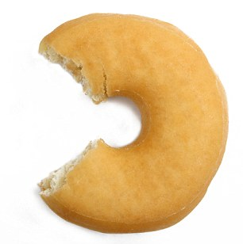

# Working your way around the donut

## Working your way around the donut {.build}

  

>  Q: Getting rid of the sketchy part of my sample left me with a donut hole in the middle, right around the cutpoint.  How does that help me to estimate the regression line's limits as it approaches the cutpoint from above and from below?    

    

>    A:  That hole in the middle only counts against limit interpretations of RDDs...

<!-- 1 slide: RI -->

## Residual ignorability {.build .smaller}

<!-- ignorability of covariate residuals; outcome residual ignorability -->

**_Notation_**: $e_\theta(\cdot| \cdot)$ denotes a _residual transformation_, typically $e_{(a,b)}(y |r) = y - a -br$.  

(If $(\hat\alpha, \hat\beta)$ come from fitting $Y=\alpha + \beta R + \epsilon$, this $e_{(\hat \alpha, \hat \beta)}(y_i | r_i)$ is a simple residual; but if $Y=\alpha + \beta R + \tau Z+ \epsilon$ was fit, then  $e_{(\hat \alpha,\hat \beta)} (y_i | r_i)$ is the _partial_ residual omitting $Z$s, $y_i-\hat\alpha - \hat\beta r_i$.)

<!--Postpone more elaborate one until we need it? $e_{(a,b,s)}(y |r) = \mathrm{sign}(y -a -br) \min(|y-a-br|/s, 1.55)$. -->

**_Assumption: Ignorability of covariate residuals_**.  For given $\hat{\theta}_x$, $e_{\theta}(\cdot |\cdot)$, 
$$e_{\bar{\theta}_x} (X|R) \perp Z | \{R \in \mathcal{W}\},\, \text{where}\, \hat{\theta}_x \stackrel{P}{\rightarrow} \bar{\theta}_x.$$ 

**_Assumption: Ignorability of potential outcome residuals_**. For given $\hat{\theta}_y$, $e_\theta(\cdot |\cdot )$,
$$e_{\bar{\theta}_y} (Y_C|R) \perp Z | \{R \in \mathcal{W}\}, \, \text{where}\, \hat{\theta}_y \stackrel{P}{\rightarrow} \bar{\theta}_y.$$ 

**_Key advantages_**. Identification of $E[Y - Y_C| Z=1, R\in \mathcal{W}]$. $\mathcal{W}$ doesn't shrink as $n\uparrow \infty$. Donuts allowed.  

## Working our way around the donut

>  Q: Getting rid of the sketchy part of my sample left me with a donut hole in the middle, right around the cutpoint.  How does that help me to estimate the regression line's limits as it approaches the cutpoint from above and from below?    

>  A:  That hole in the middle only counts against limit-based interpretations of RDDs. Residual ignorability supports large-sample inference on differences of potential outcomes, as opposed to differences of limits of curves. 
