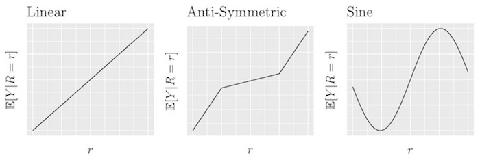
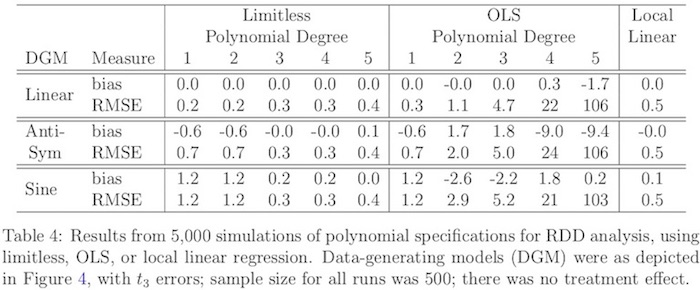

# Are the answers any different?

## Are the answers any different? {.build}

> Q: Does bounded influence regression (following testing and adjustment of $\mathcal{W}$) give answers that are any different than RDD methods already in use?

> A: Sometimes yes, sometimes no....

##  Data analysis

 Academic probation and later GPA at the 3 Canadian colleges:
 
|                  |Estimate |95\% CI     |$\mathcal{W}$ |n     |
|:-----------------|:--------|:-----------|:-------------|-----:|
|Local OLS         |0.23     |(0.19,0.28) |[0.01,1.24)   | 26000| 
|Limitless         |0.24     |(0.17,0.31) |[0.01,0.50)   | 10000|
|Local Permutation |0.11     |(0.05,0.17) |[0.01,0.18)   |  3400|

- Here limit-based Local OLS, Limitless tell similar stories.  (If present, contamination was benign.)
- Here OLS's CI narrower, due to its $n$/$\mathcal{W}$ being larger. (Characteristic of this analysis, not these methods.) 
- Local Permutation tells a different story.  (Also suffers known bias...)

 

- (The McCrary test finding said contamination _could have_ occurred, not that it did.)
- 
-  "Local Permutation" suffers known bias, of the type we saw in using permutations to test for imbalance at baseline.  But is it enough to distort the estimate?  Simulations will suggest the answer is yes.

## Simulation: linear, well-spec.'d $E(Y \vert R$) {.build .smaller}

<!---->

- Permutation (Cattaneo et al '14) shows inadmissible bias, undercoverage.
- Limitless, Local OLS use a well-specified $E(Y_C | R)$ model. They cover well, w/ little bias.
- Limitless's CIs narrower with heavier-tailed effects ($Y_{Ti}-Y_{Ci}$) and/or errors ($Y_i-E(Y | R)$). 

## Simulation: polynomial regression

## Are the answers any different?

> Q: Does bounded influence regression (following testing and adjustment of $\mathcal{W}$) give answers that are any different than RDD methods already in use?

> A: Sometimes yes, sometimes no. Differences are more likely with heavy tailed errors, which give the robust method a heavy efficiency advantage. When differences occur, diagnostics show you why, and are likely to impugn the other method.

