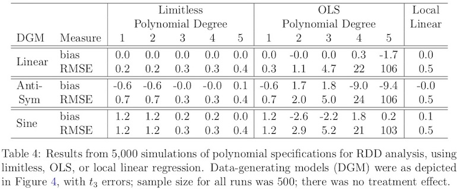
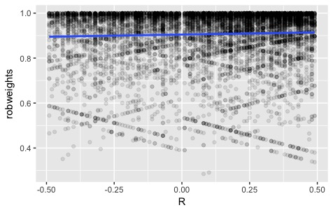

<!-- nocite:
  @hansenSales2015cochran-->
  
```{r setup, include=FALSE}
knitr::opts_chunk$set(echo = FALSE, warning = FALSE)
```


# Three perspectives on the regression discontinuity design 
<!-- Potential outcomes vs structural modeling for RDDs -->

## Academic probation and later grades | Data from 3 Canadian colleges [Lindo et al -@lindo2010ability] {.build}

<div class="centered">
<!--  -->

<!-- maybe I want something wider & shorter-->

</div>

Problem: _net of the running variable_ $R$ (college year 1 grade avg. or GPA), what's $Z \equiv \mathcal{I}[R<0]$'s effect on $Y$ (year 2 GPA)?  

(A _regression discontinuity_ estimate of academic probation's impact.) 

<div class="notes">

- A study of academic probation within a Canadian university system
- Assignment to treatment vs control determined by position of "running variable" relative to threshold value.
- Regression discontinuity designs collect data of this broad structure, look for a discontinuity at threshold...
- as we appear to see here.  What does it mean to call this the causal effect of AP?

</div>

## Regression discontinuity designs | (RDDs): Three causal interpretations {.smaller}

> - Traditional view [@thistlethwaite1960regression]: Assume $Y = \alpha + \tau Z + \beta R + \epsilon$, $\epsilon \perp R$.  The causal effect is $\tau$. 
> - Limit-based view [@hahn2001iae; @imbens2008regression]:  Perhaps $E(Y|R, Z)$ is linear, perhaps not; causal effect is $\lim_{r\uparrow 0} E(Y|R=r) - \lim_{r\downarrow 0} E(Y|R=r) =: \tau$.
> - Potential outcomes view [@lee2008randomized; @cattaneo2014randomization;@matteiMealliObsStud]: causal effects are quantities like $E [Y_T - Y_C]=:\tau$, whatever the form of $E[Y|R]$; just as these average causal effects are nonparametrically identified in randomized trials, "local randomization" suffices in RDDs. 
>- We [@lrdauthors:main] offer a distinct intepretation of local randomization in terms of potential outcomes. It squares better with the concept of Thistlethwaite & Campbell, and with common patterns in RDD data.


# Methods for picking out RCTs within RDDs

## Methods for picking out RCTs within RDDs {.build}

>  Q: I think I'm seeing naturally occurring random assignment in the vicinity of my regression discontinuity, but it's hard to isolate the subjects whose assignment can be regarded as haphazard.  Can methods help?

>  A: To separate unwanted "chaff" from locally randomized "wheat," use specification tests....


<div class="notes">
- It's one thing to say "there was natural randomization," another to assert that every treatment assignment was random in this way. 
- To address this challenge, methodologists have proposed preliminary specification tests, and procedures built on specification tests.
- I'll review 2 of the most common tests and procedures before arguing that they aren't quite up to the task.
</div>

<!-- (2 slides: balance; McCrary)-->

## $X$es should look "locally randomized" {.smaller}

<div class="centered">
<!-- maybe I want something wider & shorter-->

</div>

> - Local randomization should be reflected in covariates, e.g. prior $G$rades ($y$ axis). 
> - Due to trend, clear that $G \not\perp \mathcal{I}[R\leq 0]$.
($G$ is not "balanced" vis a vis $Z$.)<!-- Does the `\not` come thru? -->
> - Recent "local randomization" proposals confine attention to $\{R \in \mathcal{W}\}$, $\mathcal{W}$ narrow enough that $H: G \perp \mathcal{I}[R\leq 0] \vert \{R \in \mathcal{W}\}$ is not rejected.
> - We follow limit-based methods in first modeling trend, e.g. $G \approx \alpha_G + \beta_G R$. Then we check balance of $G$'s _residual_, i.e. test $H': e_{(\alpha_G, \beta_G)}(G|R) \perp \mathcal{I}[R\leq 0] \vert \{R \in \mathcal{W}\}$. 

<div class="notes">

- In general, $H'$ is sustainable with wider $\mathcal{W}$ than $H$. (Don't throw away good data!)
- In Lindo et al dataset, permutation tests comparing $X$es above and below 0 reject for windows w/ half-width $> .3$
- The window we considered had half-width $.5$.  Removing linear trend, its residuals are perfectly balanced.  

</div>

## Local randomization & the density of $R$ | the McCrary [-@mccrary2008manipulation] test

<div class="columns-2">


>  - Purpose of test: expose whether subjects secured or avoided treatment by manipulating their $R$s.
>  - If so, then density of $R$ differs on either side of cutpoint.
<!--
>  - Pick narrow $\tilde{\mathcal{W}} \subseteq \mathcal{W}$, test $\tilde{H}: \log \big[\frac{d}{dt} \mathrm{Pr}(R \leq t)\big]_{t=R} \perp \mathcal{I}[R\leq 0] | \{R \in \tilde{\mathcal{W}}\}.$ 
-->
>  - Canadian colleges data have a clump at $R=0$. McCrary throws a red flag!  

  


</div>

> - To avoid rejecting $\tilde{H}$, $\mathcal{W} \mapsto \mathcal{W}\setminus \{0\}$ and $\tilde{\mathcal{W}} \mapsto \tilde{\mathcal{W}}\setminus \{0\}$. (Carve hole in middle, leaving a "donut.")

<div class="notes">

- The widely used McCrary test checks for equal density of R immediately to either side of the cutpoint 
- no-manipulation hypothesis is rejected, due to chunk of students avoiding AP by falling exactly on top of the cutpoint
- Removing that chunk and that chunk only gets us a pass on this test.  
- thinking of this block of students as analogous to attriters in an RCT, this is differential attrition.  

</div>

## Methods for picking out RCTs within RDDs

> Q: I think I'm seeing naturally occurring random assignment in the vicinity of my regression discontinuity, but it's hard to isolate the subjects whose assignment can be regarded as haphazard.  Can methods help?

> A: To separate unwanted chaff from locally randomized wheat, use specification tests. 
> Seen in this light, common regression discontinuity design (RDD) specification tests come to resemble covariate balance checks used with propensity scores, but with an important difference: they test "ignorability" of covariate residuals, not covariates themselves.  As in matching, remedies for test failure may involve reducing the sample.

# Working your way around the donut

<!-- TO CONSIDER NEXT TIME YOU'RE PREPPING THIS PRES:
If I can think of a way to add an image to the transition slide,
this one would be cute: images/donut-partly-eaten.jpg -->

## Working your way around the donut {.build}


>  Q: Getting rid of the sketchy part of my sample left me with a donut hole in the middle, right around the cutpoint.  How does that help me to estimate the regression line's limits as it approaches the cutpoint from above and from below?    
>    A:  That hole in the middle only counts against limit interpretations of RDDs...

<!-- 1 slide: RI -->

## Residual ignorability {.build .smaller}

<!-- ignorability of covariate residuals; outcome residual ignorability -->

**_Notation_**: $e_\theta(\cdot| \cdot)$ denotes a _residual transformation_, typically $e_{(a,b)}(y |r) = y - a -br$.  

(If $(\hat\alpha, \hat\beta)$ come from fitting $Y=\alpha + \beta R + \epsilon$, this $e_{(\hat \alpha, \hat \beta)}(y_i | r_i)$ is a simple residual; but if $Y=\alpha + \beta R + \tau Z+ \epsilon$ was fit, then  $e_{(\hat \alpha,\hat \beta)} (y_i | r_i)$ is the _partial_ residual omitting $Z$s, $y_i-\hat\alpha - \hat\beta r_i$.)

<!--Postpone more elaborate one until we need it? $e_{(a,b,s)}(y |r) = \mathrm{sign}(y -a -br) \min(|y-a-br|/s, 1.55)$. -->

**_Assumption: Ignorability of covariate residuals_**.  For given $\hat{\theta}_x$, $e_{\theta}(\cdot |\cdot)$, 
$$e_{\bar{\theta}_x} (X|R) \perp Z | \{R \in \mathcal{W}\},\, \text{where}\, \hat{\theta}_x \stackrel{P}{\rightarrow} \bar{\theta}_x.$$ 

**_Assumption: Ignorability of potential outcome residuals_**. For given $\hat{\theta}_y$, $e_\theta(\cdot |\cdot )$,
$$e_{\bar{\theta}_y} (Y_C|R) \perp Z | \{R \in \mathcal{W}\}, \, \text{where}\, \hat{\theta}_y \stackrel{P}{\rightarrow} \bar{\theta}_y.$$ 

**_Key advantages_**. Identification of $E[Y - Y_C| Z=1, R\in \mathcal{W}]$. $\mathcal{W}$ doesn't shrink as $n\uparrow \infty$. Donuts allowed.  

## Working our way around the donut


>  Q: Getting rid of the sketchy part of my sample left me with a donut hole in the middle, right around the cutpoint.  How does that help me to estimate the regression line's limits as it approaches the cutpoint from above and from below?    


>  A:  That hole in the middle only counts against limit-based interpretations of RDDs. Residual ignorability supports large-sample inference on differences of potential outcomes, as opposed to differences of limits of curves. 

# Methods for limiting contamination sensitivity

## Methods for limiting contamination sensitivity {.build}

>   Q: Tests and adjustments may have gotten rid of the better part of the sample that didn't belong, but maybe they didn't remove every last bit of contamination.  Should we supplement our OLS estimates with a secondary analysis of sensitivity to this problem?

>   A:  The contamination issue must be addressed as a part of the _primary_ analysis. It requires us to abandon OLS,...


<!-- 2 slides: LSO, Krafft points; robust MM regression-->

## Sensitivity to removing _groups_ of points {.build}

Say there are "savvy" students who, when at risk for AP, "manipulate" grades $\uparrow$. (Bribes?)   
This latent subgroup is overrepresented in excised donut hole $\{i: z_i=0\}$, but may be elsewhere too. As many as $O(n^{1/2})$ "bad" points remain, undercutting estimation of $E(Y_C | R)$. 

How does this affect $\hat\tau$? --- A _contamination sensitivity_ problem, if not recognized as such in RDD literature.

<div class="columns-2">


</div>

<div class="notes">

- At right, molecular design example discussed in _Robust Statistics_ text.  Think of rightmost 3 points as latent subgroup.  Large effect on OLS, less on robust method.
- If the latent subgroup is both different and large, we ought to be able to find it in tests.
- Otherwise, we're in the domain of "$\epsilon$ contamination"
- OLS handles $\epsilon$ contamination poorly. Methods that handle it better explore the sample systematically to find small subsets of points the exclusion of which changes the answer, then downweight these, sometimes 0.

</div>

## Robust MM estimates of regression | a high-level review {.build}

- Robust regression substitutes out OLS' $e_{(a,b)}(y|r) = y-a-br$ with $e_{(a,b,s)}(y|r) = \psi\{(y - a -br)/s\}$, some $\psi(\cdot)$, $s(\cdot)$.
- After much study, robustness literature identified pairs $(\psi, s)$ that handle groups of outliers while retaining $\sqrt{n}$ rates, efficiency.
- E.g., "MM with bisquare psi-function and robust scale",...
- In R, `robustbase::lmrob`; in Stata, `mmregress`.
- <!-- Asymptotically,--> To limit sensitivity to contamination of a $O(n^{-1/2})$ share of the sample, OLS won't do. Need robust MM regression [@he1991localbreakdown; @yohaiZamar1997locallyrobustMestimates].


## Methods for limiting contamination sensitivity

> Q: Tests and adjustments may have gotten rid of the better part of the sample that didn't belong, but maybe they didn't remove every last bit of contamination.  Is there a sensitivity analysis method that addresses this issue?


> A: With RDDs, there's a better option than post hoc sensitivity analysis.  You can address sensitivity to contamination (as opposed to omitted variable sensitivity) as a part of the primary analysis, with the help of robust MM estimators.  While less familiar in social science, these methods are efficient, easy to use and readily available in R and Stata.

# Are the answers any different?

## Are the answers any different? {.build}

> Q: Does bounded influence regression (following testing and adjustment of $\mathcal{W}$) give answers that are any different than RDD methods already in use?

> A: Sometimes yes, sometimes no....


## Simulation {.build .smaller}

 
 
- Each method mildly anti-conservative for small $n$.  
- Only limitless, local OLS improve as $n$ increases.

- Under Normal errors, limitless and local OLS are similarly powered.
- Under $t_3$ errors, limitless has much more power.

##  Data analysis

 Regarding academic probation at the 3 Canadian universities, MM estimation w/ bisquare psi tells a different story than local randomization methods without detrending, but a similar story to a common limit-based method.
 
|                  |Estimate |95\% CI     |$\mathcal{W}$ |n     |
|:-----------------|:--------|:-----------|:-------------|-----:|
|Limitless         |0.24     |(0.17,0.31) |[0.01,0.50)  | 10000|
|Local Permutation |0.11     |(0.05,0.17) |[0.01,0.18)   |  3400|
|Local OLS         |0.23     |(0.19,0.28) |[0.01,1.24)   | 26000| 

 
 
## The robustness weights diagnostic {.build}

- Robust regression fitting generates "robustness" weights $\in [0,1]$, showing which observations the fitter deemed to be anomalous.
- If $\mathcal{W}$ is still too wide, or its donut hole isn't wide enough, plot of robustness weights against $R$ gives an additional shot at detection.  
- 

<!--  (To assign 0's to truly anomalous observations, not just any robust method will do; you need bounded influence regression.)-->


## Are the answers any different?

> Q: Does bounded influence regression (following testing and adjustment of $\mathcal{W}$) give answers that are any different than RDD methods already in use?

> A: Sometimes yes, sometimes no. Differences are more likely with heavy tailed errors, which give the robust method a heavy efficiency advantage. When differences occur, diagnostics show you why, and are likely to impugn the other method.


## Discussion {.smaller}
<!-- Some of these points were added for ICORS audience. 
     For other audiences, cut/adjust as appropriate. -->

- In limit-based literature, main concern is with possibility that bandwidth/$\mathcal{W}$ is too wide.  To be "robust" to overly wide $\mathcal{W}$, prominent limit-based methods use local polynomials --- along w/ unbounded $\rho(\cdot)$, non-robust $s(\cdot)$.
- In the local randomization camp, recent methods narrow the window until covariates appear to be balanced. Typically there is no allowance for $Y$--$R$ association other than via $Z=\mathcal{I}[R<0]$. 
- Limit-based and local randomizers both led to reduce $n$.  This makes contamination harder to detect, and limits even robust M-estimates' capacity to compensate.
- Under moderate departure from linearity, robust M-estimation markedly improves power & type 1 error rates; see Sec. 5 of manuscript (`arxiv.org/abs/1403.5478`)
<!--
- Does a narrow enough "bandwidth" such as our $R\in [-.5, .5]$ entail that MM estimates are also bounded influence GM estimates?  If so, then $\mathrm{MaxBias}_\epsilon = O(\epsilon)$, not $O(\sqrt{\epsilon})$, as $\epsilon \downarrow 0$ [@he1991localbreakdown] --- a more satisfying complement to sample purification via specification tests.
-->

## References {.smaller}


