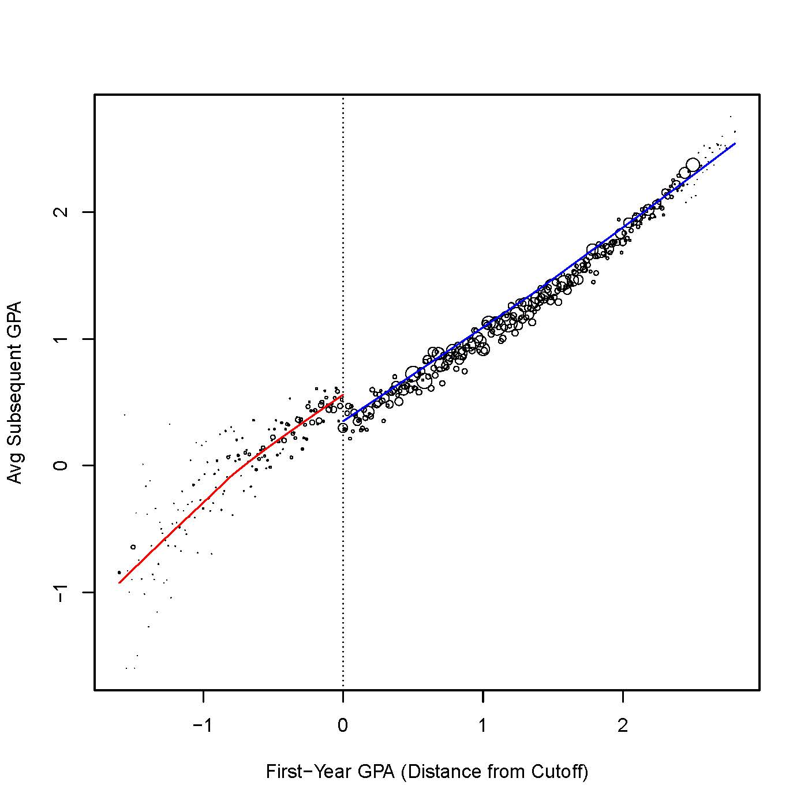
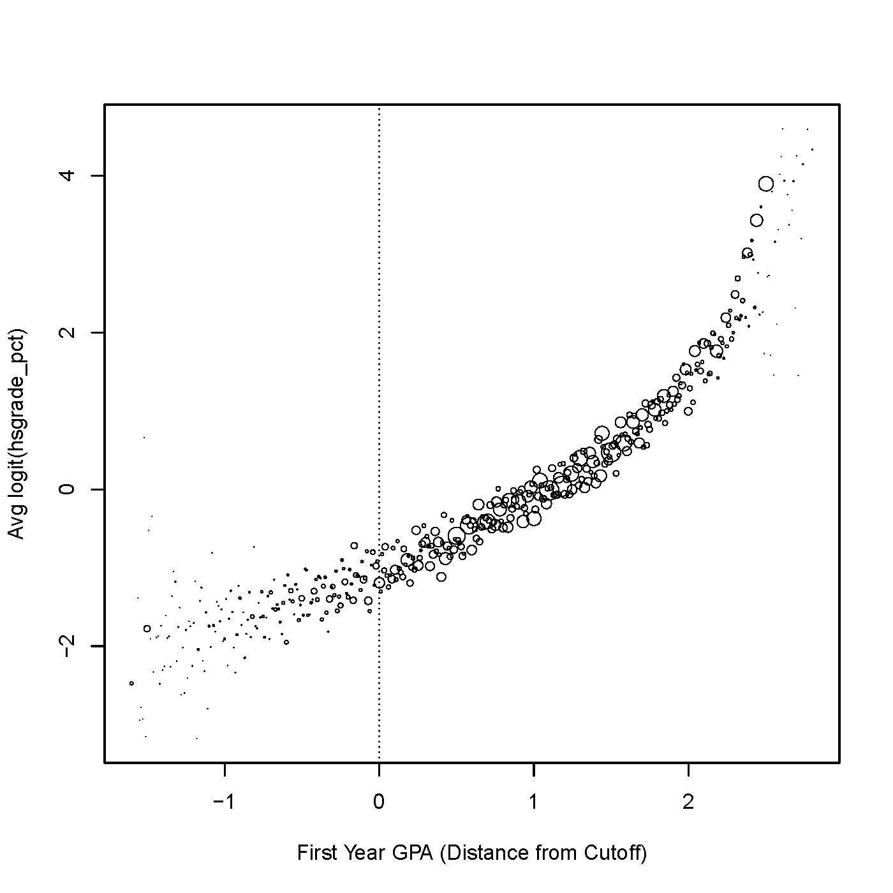
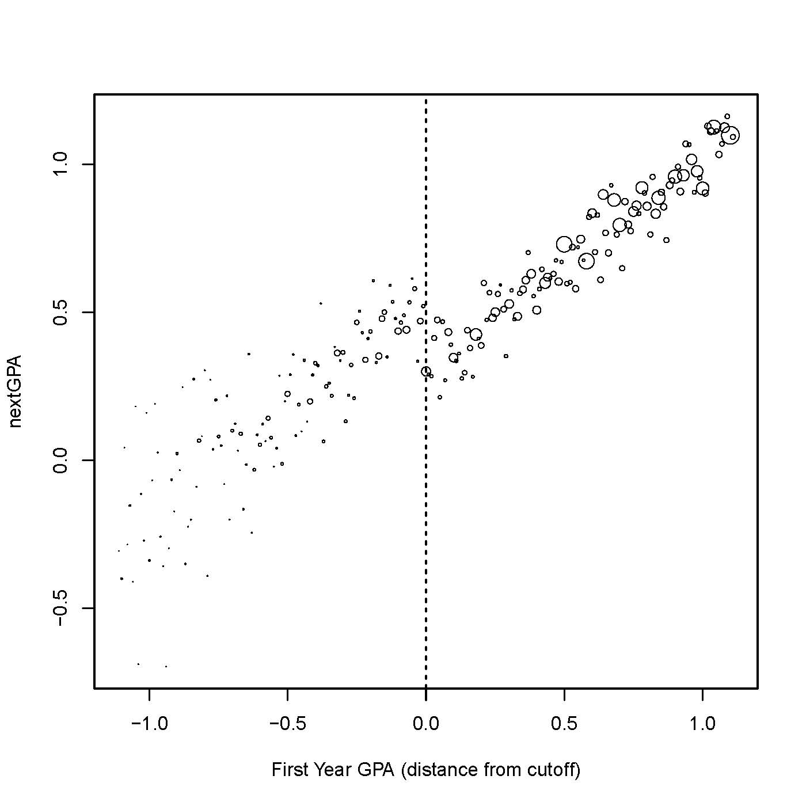
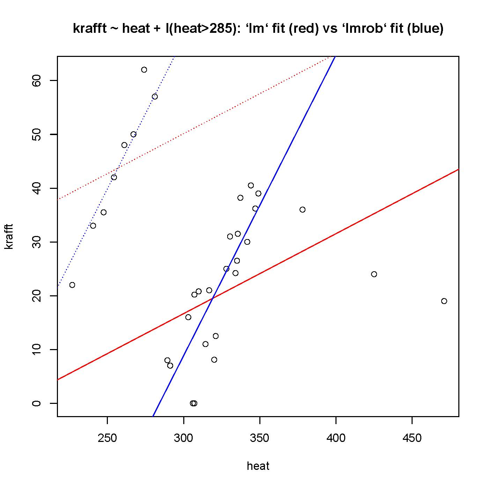

<!-- nocite:
  @hansenSales2015cochran-->
  
```{r setup, include=FALSE}
knitr::opts_chunk$set(echo = FALSE)
```


# Potential outcomes vs structural modeling for RDDs

## Academic probation and subsequent achievement: a "running" example | ... from Lindo, Sanders & Oreopoulos [-@lindo2010ability]  

<div class="centered">
<!-- maybe I want something wider & shorter-->

</div>

Problem: _net of the running variable_ $R$ (college year 1 GPA), what's $Z \equiv [[R<0]]$'s causal effect on $Y$ (subsequent GPA)?

## Regression discontinuity designs | (RDDs): Two views

> - Regression-based view [@thistlethwaite1960regression]: Assume $Y = \alpha + \tau Z + \beta R + \epsilon$, $\epsilon \perp R$, at least locally [@imbens2008regression, ...].  The causal effect is $\tau$. 
> - Potential outcomes view [@lee2008randomized; @cattaneo2014randomization; @liMatteiMealli2015BayesianRD]: causal effects are quantities like $E [Y_T - Y_C]$, whatever the form of $E[Y|R]$; "local randomization"" gives them to us via ancova/permutation testing/.... 
>- Our paper [-@sales2015limitless] explores requirements and implications of potential outcomes+"local randomization." 

# Methods for picking out RCTs within RDDs

## Methods for picking out RCTs within RDDs {.build}

>  Q: I think I'm seeing naturally occurring random assignment in the vicinity of a regression discontinuity, but it's hard to isolate the subjects whose assignment can be regarded as haphazard.  Can methods help?

>  A: To separate unwanted chaff from locally randomized wheat, use specification tests....


<!-- (2 slides: balance; McCrary)-->

## $X$es should look "locally randomized" {.smaller}

<div class="centered">
<!-- maybe I want something wider & shorter-->

</div>

> - Bandwidth selectors don't look at covariates. 
> - H.s. grades (vertical axis) not "balanced", due to trend.
> - Narrowing window to avoid significant imbalance gets rid of too much data.
> - Removing linear trend, then testing balance on residuals, works better.

<div class="notes">

- A modern bandwidth selection chose a window too wide for the linear model
- permutation tests comparing $X$es above and below 0 reject for windows w/ half-width > .3
- The window we considered had half-width $.5$.  Removing linear trend, its residuals are perfectly balanced.  

</div>

## Testing balance on the density of $R$ | the McCrary [-@mccrary2008manipulation] test


</div>

<div class="notes">

- The widely used McCrary test checks for equal density of R immediately to eithert side of the cutpoint 
- no-manipulation hypothesis is rejected, due to chunk of students avoiding AP by falling exactly on top of the cutpoint
- Removing that chunk and that chunk only gets us a pass on this test.  
- thinking of this block of students as analogous to attriters in an RCT, this is differential attrition.  

</div>

## Methods for picking out RCTs within RDDs

> Q: I think I'm seeing naturally occurring random assignment in the vicinity of a regression discontinuity, but it's hard to isolate the subjects whose assignment can be regarded as haphazard.  Can methods help?

> A: To separate unwanted chaff from locally randomized wheat, use specification tests. 
> Seen in this light, common regression discontinuity design (RDD) specification tests come to resemble covariate balance checks used in refining a propensity score match, but with an important difference: they test "ignorability" of covariate residuals, not covariates themselves.

# Working your way around the donut

## Working your way around the donut {.build}

>  Q: Getting rid of the sketchy part of my sample left me with a donut hole in the middle, right around the cutpoint.  How does that help me to estimate the regression line's limits as it approaches the cutpoint from above and from below?    
>    A:  That hole in the middle only counts against limit interpretations of RDDs...

<!-- 1 slide: RI -->

## Residual ignorability {.build .smaller}

<!-- ignorability of covariate residuals; outcome residual ignorability -->

**_Notation_**: $e_\theta(\cdot| \cdot)$ denotes a _residual transformation_, typically $e_{(a,b)}(y |r) = y - a -br$.  

(If $(\hat\alpha, \hat\beta)$ come from fitting $Y=\alpha + \beta R + \epsilon$, then $e_{(\hat \alpha, \hat \beta)}(y_i | r_i)$ is a simple residual; if from fit of $Y=\alpha + \beta R + \tau Z+ \epsilon$, then  $e_{(\hat \alpha,\hat \beta)} (y_i | r_i)$ is a partial residual.)

<!--Postpone more elaborate one until we need it? $e_{(a,b,s)}(y |r) = \mathrm{sign}(y -a -br) \min(|y-a-br|/s, 1.55)$. -->

**_Assumption: Ignorability of covariate residuals_**.  For given $\hat{\theta}_x$, $e_{\theta}(\cdot |\cdot)$, 
$$e_{\bar{\theta}_x} (X|R) \perp Z | \{R \in \mathcal{W}\},\, \text{where}\, \hat{\theta}_x \stackrel{P}{\rightarrow} \bar{\theta}_x.$$ 

**_Assumption: Ignorability of potential outcome residuals_**. For given $\hat{\theta}_y$, $e_\theta(\cdot |\cdot )$,
$$e_{\bar{\theta}_y} (Y_C|R) \perp Z | \{R \in \mathcal{W}\}, \, \text{where}\, \hat{\theta}_y \stackrel{P}{\rightarrow} \bar{\theta}_y.$$ 

**_Key advantages_**. Identification of $E[Y - Y_C| Z=1, R\in \mathcal{W}]$. $\mathcal{W}$ doesn't shrink as $n\uparrow \infty$. Donuts allowed.  

## Working our way around the donut

>  Q: Getting rid of the sketchy part of my sample left me with a donut hole in the middle, right around the cutpoint.  How does that help me to estimate the regression line's limits as it approaches the cutpoint from above and from below?    


>  A:  That hole in the middle only counts against limit-based interpretations of RDDs. Residual ignorability supports large-sample inference on differences of potential outcomes, as opposed to differences of limits of curves. 

# Methods for limiting contamination sensitivity

## Methods for limiting contamination sensitivity {.build}

>   Q: Tests and adjustments may have gotten rid of the better part of the sample that didn't belong, but maybe they didn't remove every last bit of contamination.  Is there a sensitivity analysis method that addresses this issue?

>   A: You can address sensitivity to contamination during the _primary_ analysis...


<!-- 2 slides: LSO, Krafft points; bounded influence regression-->

## Sensitivity to removing _groups_ of points {.build}

Suppose a latent subgroup, "savvy," that's overrepresented in $\{i: z_i=0\}$.  We can't locate them, but if we could we'd take them all out. How much could this change effect estimates? --Quite a bit less if we use _bounded influence robust regression_ than if we use OLS.

<div class="columns-2">



</div>

##Bounded influence robust regression

<!--residual trans w/ a redescending psi; contamination sensitivity; R and Stata implementations-->


## Methods for limiting contamination sensitivity

> Q: Tests and adjustments may have gotten rid of the better part of the sample that didn't belong, but maybe they didn't remove every last bit of contamination.  Is there a sensitivity analysis method addresses this issue?


> A: You can address sensitivity to contamination (as opposed to omitted variables) as a part of the primary analysis.  The robust statistics literature finds that only an unusual type of regression limits contamination sensitivity.  While unfamiliar, the methods are efficient, easy to use and readily available in R and Stata.


## References {.smaller}


