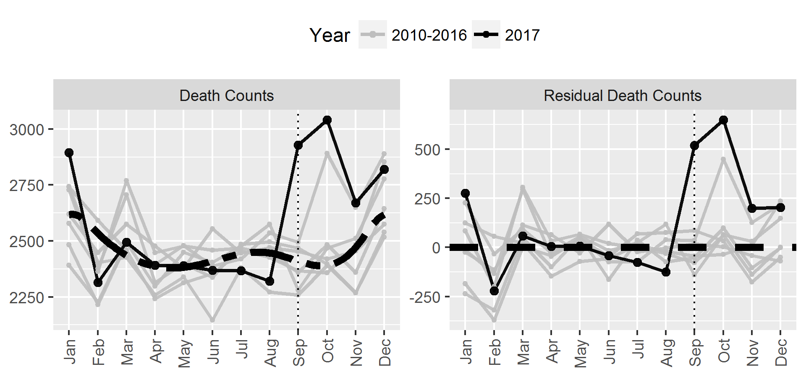

```r
knitr::opts_chunk$set(echo = TRUE,error=FALSE, warning=FALSE,cache=FALSE,message=FALSE)

library(robustbase)
library(pbs)
library(tidyverse)
```

```
## -- Attaching packages ---------------------------------- tidyverse 1.2.1 --
```

```
## v ggplot2 2.2.1       v purrr   0.3.2  
## v tibble  2.1.1       v dplyr   0.8.0.1
## v tidyr   0.8.3       v stringr 1.2.0  
## v readr   1.1.1       v forcats 0.2.0
```

```
## -- Conflicts ------------------------------------- tidyverse_conflicts() --
## x dplyr::filter() masks stats::filter()
## x dplyr::lag()    masks stats::lag()
```

Monthy mortality data in Puerto Rico generously provided by Alexis
R. Santos-Lozada [sites.psu.edu/alexisrsantos]

```r
datM <- read.csv('extdata/death_file_JAMA.csv')


datM$hurYear <- datM$year==2017
datM$year <- as.factor(datM$year)
rownames(datM) <- paste0(month.abb[datM$month_num],substr(datM$year,3,4))

datM$deaths <- datM$deaths_original
```

model monthly deaths prior to 2017:

```r
mod  <-   lmrob(deaths~year+
                     pbs(month_num, knots=seq(2,11,by=3)),
                 data=datM,subset=!hurYear)

### predict monthly
fitCurve <- function(x,year='avg'){
  nd <- data.frame(month_num=x,year=ifelse(year=='avg','2010',year))
  out <- predict(mod,nd)
  if(year=='avg') out <- out+sum(coef(mod)[2:7])/8
  out
}


datM$yhat <- NA
datM$yhat[!datM$hurYear] <- predict(mod)
datM$yhat[datM$hurYear] <- fitCurve(datM$month_num[datM$hurYear],'avg')

datM$resid <- datM$deaths-datM$yhat

datM$Z <- datM$month_num>8
```

Make Figure 1:

```r
pd <- rbind(datM,datM)
pd$Deaths <- c(datM$deaths,datM$resid)
pd$type <- factor(c(rep('Death Counts',nrow(datM)),rep('Residual Death Counts',nrow(datM))),
                  levels=c('Death Counts','Residual Death Counts'))
pd$hurYear <- factor(ifelse(pd$hurYear,'2017','2010-2016'))

ggplot(pd,aes(month_num,Deaths,group=year,color=hurYear,size=hurYear,alpha=hurYear))+
  geom_line(size=1)+geom_point()+
  scale_x_continuous(NULL,breaks=1:12,labels=month.abb,minor_breaks=NULL)+ylab(NULL)+
  scale_color_manual(name='Year',values=c('grey','black'))+
  geom_vline(xintercept=9,linetype='dotted')+
  scale_size_discrete(range=c(1,2),guide=FALSE)+scale_alpha_discrete(range=c(.9,1),guide=FALSE)+
  facet_wrap(~type,nrow=1,scales='free_y')+
  geom_hline(data=data.frame(yint=0,type='Residual Death Counts'),aes(yintercept=yint),
    size=2,color='black',linetype='dashed')+
  stat_function(data=data.frame(x=datM$month_num,type='Death Counts',y=datM$deaths,year='avg',hurYear=TRUE),
    aes(x=x,y=y), fun=fitCurve,size=2,color='black',linetype='twodash')+
  theme(axis.text.x = element_text(angle = 90, vjust = 0.5, hjust=1),legend.pos='top')
```



Estimate/test death toll:

```r
N1 <- sum(datM$hurYear&datM$Z)
N0 <- sum(datM$hurYear&!datM$Z)
N <- N1+N0
cardZ <- choose(N,N1)

## adapted from http://rsnippets.blogspot.com/2012/04/generating-all-subsets-of-set.html
all.subsets <- function(set,size) {
  n <- length(set)
  bin <- expand.grid(plyr::rlply(n, c(F, T)))
  if(!missing(size)) bin <- bin[rowSums(bin)==size,]
  bin
}

subs <- all.subsets(1:N,N1)
stopifnot(nrow(subs)==cardZ)

rr <- datM$resid[datM$hurYear]
z <- datM$Z[datM$hurYear]

testStat <- function(Z,RR)
  sum(RR[Z])

ts0 <- apply(subs,1,testStat,RR=rr)
stopifnot(length(unique(ts0))==cardZ) ## no Test stat value appears more than once; simplifying

pfun <- function(tau){
  RR <- rr-z*tau
  ts <- testStat(z,RR)
  TS <- apply(subs,1,testStat,RR=RR)
  nless <- sum(TS<ts)
  nmore <- cardZ-nless-1
  pHigh <- (nmore+.5)/cardZ
  pLow <- (nless+.5)/cardZ
  c(nless=nless,nmore=nmore,p=2*min(pHigh,pLow),diff=abs(mean(TS)-ts))
}

pval <- pfun(0)
print(paste('P-value testing hypothesis of no excess deaths:',pval['p']))
```

```
## [1] "P-value testing hypothesis of no excess deaths: 0.0101010101010101"
```

```r
tau <- 0
rej <- TRUE
diff <- NULL
while(rej){
  tau <- tau+1
  p <- pfun(tau)
  diff <- rbind(diff,c(tau,p['diff']))
  rej <- p['p']<0.05
}
lb <- tau

print(paste('95% lower bound for excess deaths per month:',lb))
```

```
## [1] "95% lower bound for excess deaths per month: 170"
```

```r
print(paste('95% lower bound for total excess deaths in 2017:',lb*4))
```

```
## [1] "95% lower bound for total excess deaths in 2017: 680"
```
